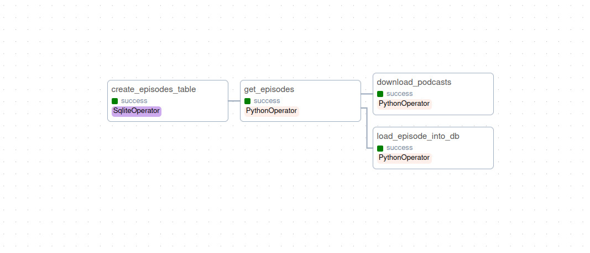

# Podcast-Episodes-using-Apache-Airflow
Building a data pipeline that can download and store podcast episodes using Apache Airflow.

## Project Overview
This project involves the creation of a data pipeline utilizing Airflow. The pipeline's objective is to download podcast episodes and perform automatic transcription using speech recognition. The results will be stored in an easily queryable SQLite database.

Using Airflow can inclusion provides several advantages:
* Schedule the project to run daily
* Run independently, and we get error logs
* Easily parallelize tasks and run in the cloud if we want to
Additionally, We can extend this project more easily (add speech recognition, summaries, etc) using Airflow By the end of this project, you'll have a good understanding of how to use Airflow, along with a practical project that you can continue to build on.

## Project Steps
* Download the podcast metadata xml and parse
* Create a SQLite database to hold podcast metadata
* Download the podcast audio files using requests

## Snapshots

### DAG

